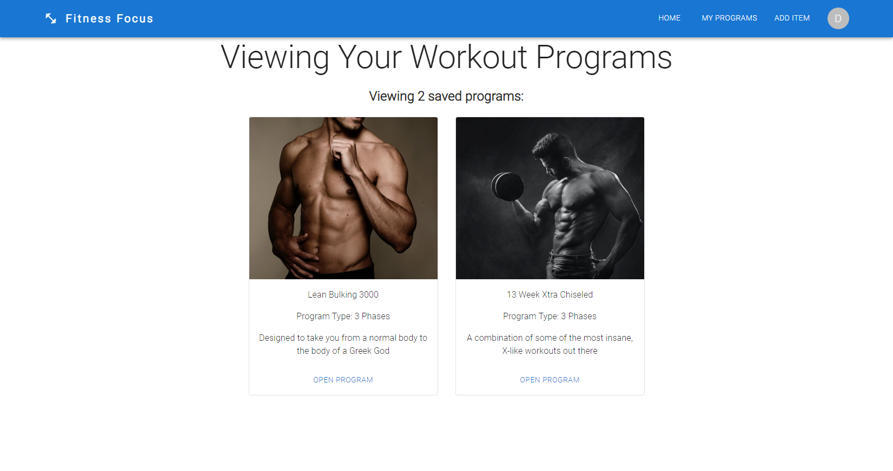

# Fitness Focus - A MERN Project

## Final Deployed Webpage

[Fitness Focus Deployed Application (powered by Heroku)](https://fitnessfocus.herokuapp.com/)

## Table of Contents

1. [Description](#description)
2. [Task Completed]('#task-completed')
3. [Installation](#installation)
4. [Usage](#usage)
5. [License](#license)
6. [Contributing](#contributing)
7. [Questions](#questions)

## Description

The goal of this application is to track specific workouts for a signed-up user with a performant backend and slick frontend by using MongoDB, Express, React, and Node (MERN).

### Task Completed

I've built this application from scratch by utilizing a GraphQL API built with an Apollo Server. By building it with a MERN stack, it allows users to save their progress over time to the back end.

Essentially, I've set up the Apollo Server to use GraphQL queries and mutations to fetch and modify data. I've also implemented an authentication middleware so that it works in the GraphQL API context by creating an Apollo Provider to communicate with the Apollo Server.

This self-driven project should set myself up for future success by applying the core skills I've recently learned, primarily integrating various platforms into one, user-friendly application. 

## Installation

This project is deployed via Heroku. To install a local instance, simply download this repo and run npm install and npm run build. 

## Usage

This project is meant to provide an easy solution implement more powerful and efficient workout tracker. It is also used to save user data by saving their workout progress over time.  

## License

This project is licensed under the MIT license.

## Contributing

To contribute to this repository, simply create a pull request, create issues, or reach out to me (see [Questions](#questions) below). I do my best to ensure that pull requests are up to date. 

## Questions

If you have any questions, reach out to me through either of the methods below:
- [GitHub - J03B](https://github.com/J03B/)
- [email - (byucrazyfan@gmail.com)](mailto:byucrazyfan@gmail.com)
